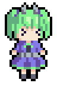

# Animdustry Mod Loader

A modloader for the anime gacha bullet hell rhythm game by Anuke.

[Downloads for windows/linux/android are available on the releases page.](https://github.com/Pasu4/animdustry/releases)

# Compiling

For information on compiling, please refer to [the original repository](https://github.com/Anuken/animdustry/blob/master/README.md#compiling).

# Credits

Original game by Anuke

Modloader programming and documentation by Pasu4

music used:

- [Aritus - For You](https://soundcloud.com/aritusmusic/4you)
- [PYC - Stoplight](https://soundcloud.com/pycmusic/stoplight)
- [Keptor's Room - Bright 79](https://soundcloud.com/topazeclub/bright-79)
- [Aritus - Pina Colada II](https://soundcloud.com/aritusmusic/pina-colada-ii-final)
- [ADRIANWAVE - Peach Beach](https://soundcloud.com/adrianwave/peach-beach)

# Documentation

## Functions

- **float** *px(val)*: Turns pixel units into world units.
- **Vec2** *getScl(base)*: Used for displaying the unit portrait when rolling / clicking on a unit in the menu. Returns a scaling vector dependent on the size of the screen and the time until the unit appears.
- **Vec2** *hoverOffset(scl, offset = 0)*: Used for displaying the unit portrait when rolling / clicking on a unit in the menu. Returns a displacement vector that is used to slightly move the unit up and down periodically.
- **Vec2** *vec2(x, y)*: Constructs a 2D vector from x and y components.

## Variables

- **float** *state_secs*: Smoothed position of the music track in seconds.
- **float** *state_lastSecs*: Last "discrete" music track position, internally used.
- **float** *state_time*: Smooth game time, may not necessarily match seconds. Visuals only!
- **float** *state_rawBeat*: Raw beat calculated based on music position.
- **float** *state_moveBeat*: Beat calculated as countdown after a music beat happens. Smoother, but less precise.
- **float** *state_hitTime*: Snaps to 1 when player is hit for health animation.
- **float** *state_healTime*: Snaps to 1 when player is healed.
- **float** *state_points*: Points awarded based on various events.
- **float** *state_turn*: Beats that have passed total.
- **float** *state_hits*: The number of times the player has been hit this map. (?)
- **float** *state_totalHits*: Same as *state_hits*, probably.
- **float** *state_misses*: The number of times the player has missed an input this map. (?)
- **float** *fau_time*: The global time that is independent of the current beatmap.

- **Vec2** *basePos*: The base position of the unit portrait.
- **Vec2** *_getScl*: Calls *getScl(0.175)* (default value).
- **Vec2** *_hoverOffset*: Calls *hoverOffset(0.65, 0)* (default value).
- **Vec2** *playerPos*: Last known player position.

- **Color** *shadowColor*
- **Color** *colorAccent*
- **Color** *colorUi*
- **Color** *colorUiDark*
- **Color** *colorHit*
- **Color** *colorHeal*
- **Color** *colorClear*
- **Color** *colorWhite*
- **Color** *colorBlack*
- **Color** *colorGray*
- **Color** *colorRoyal*
- **Color** *colorCoral*
- **Color** *colorOrange*
- **Color** *colorRed*
- **Color** *colorMagenta*
- **Color** *colorPurple*
- **Color** *colorGreen*
- **Color** *colorBlue*
- **Color** *colorPink*
- **Color** *colorYellow*

## Calls

### SetFloat

Sets a float variable that is accessible from anywhere.

- **string** *name*: The name of the variable to be set.
- **float** *value*: The value to set the variable to.

### SetVec2

Sets a 2D vector variable that is accessible from anywhere.

- **string** *name*: The name of the variable to be set.
- **Vec2** *value*: The value to set the variable to.

### SetColor

Sets a color variable that is accessible from anywhere.

- **string** *name*: The name of the variable to be set.
- **Color** *value*: The color in hexadecimal notation (e.g. "#ff0000").

### DrawFft

(TODO check source)

- **Vec2** *pos*:
- **float** *radius*: (Default: *px(90)*)
- **float** *length*: (Default: *8*)
- **Color** *color*: (Default: *colorWhite*)

### DrawTiles

Draws the playing field.

### DrawTilesFft

Draws the playing field. (TODO check source)

### DrawTilesSquare

Draws diagonal stripes. (TODO check source)

- **Color** *col1*: (Default: *colorWhite*)
- **Color** *col2*: (Default: *colorBlue*)

### DrawBackground

Why does everything draw stripes?? (TODO check source)

- **Color** *col*: The color of the stripes.

### DrawStripes

Draws construction-tape-like stripes.

- **Color** *col1*: Background color. (Default: *colorPink*)
- **Color** *col2*: Stripe color. (Default: *colorPink* with 20% *colorWhite*)
- **float** *angle*: The angle of the stripes. (Default: *rad(135)*)

### DrawBeatSquare

- **Color** *col*: (Default: *colorPink* with 70% *colorWhite*)

### DrawBeatAlt

- **Color** *col*:

### DrawTriSquare

Draws regular polygons in a circle around a position.

- **Vec2** *pos*: The position to draw the polygons around.
- **Color** *col*: The color of the polygons.
- **float** *len*: How far away the polygons are from the position.
- **float** *rad*: The size of the polygons.
- **float** *offset*: Additional rotation around the target position applied to each polygon. (Default: *rad(45)*)
- **int** *amount*: The number of polygons to draw. (Default: *4*)
- **int** *sides*: How many sides each polygon has. (Default: *3*)
- **float** *shapeOffset*: Additional rotation applied to each polygon around its own center. (Default: *rad(0)*)

### DrawSpin

Draws stripes radially from the center. (TODO better explanation)

- **Color** *col1*: The first color.
- **Color** *col2*: The second color.
- **int** *blades*: The number of stripes to draw. (Default: *10*)

### DrawSpinGradient

Draws a "fan" of triangles. (TODO better explanation)

- **Vec2** *pos*: The position to center the fan on.
- **Color** *col1*: The inner color of the triangles.
- **Color** *col2*: The outer color of the triangles.
- **float** *len*: The radius of the fan. (Default: *5*)
- **int** *blades*: The number of triangles that the fan is made of. (Default: *10*)
- **int** *spacing*: How often a triangle occurs. (Default: *2*)

### DrawSpinShape

- **Color** *col1*:
- **Color** *col2*:
- **int** *sides*: (Default: *4*)
- **float** *rad*: (Default: *2.5*)
- **float** *turnSpeed*: (Default: *rad(19)*)
- **int** *rads*: (Default: *6*)
- **int** *radsides*: (Default: *4*)
- **float** *radOff*: (Default: *7*)
- **float** *radrad*: (Default: *1.3*)
- **float** *radrotscl*: (Default: *0.25*)

### DrawShapeBack

- **Color** *col1*:
- **Color** *col2*:
- **int** *sides*: (Default: *4*)
- **float** *spacing*: (Default: *2.5*)
- **float** *angle*: (Default: *rad(90)*)

### DrawFadeShapes

- **Color** *col*:

### DrawRain

- **int** *amount*: (Default: *80*)

### DrawPetals

### DrawSkats

### DrawClouds

- **Color** *col*: (Default: *colorWhite*)

### DrawLongClouds

- **Color** *col*: (Default: *colorWhite*)

### DrawStars

- **Color** *col*: (Default: *colorWhite*)
- **Color** *flash*: (Default: *colorWhite*)
- **int** *amount*: (Default: *40*)
- **int** *seed*: (Default: *1*)

### DrawTris

- **Color** *col1*: (Default: *colorWhite*)
- **Color** *col2*: (Default: *colorWhite*)
- **int** *amount*: (Default: *50*)
- **int** *seed*: (Default: *1*)

### DrawBounceSquares

- **Color** *col*: (Default: *colorWhite*)

### DrawCircles

Draws circles in random sizes that move around the screen in random directions. This effect is used for Mono, Oct and Sei.

- **Color** *col*: The color of the circles. (Default: *colorWhite*)
- **float** *time*: The circles will move if you put in a value that changes over time. (Default: *state_time*)
- **int** *amount*: The number of circles to draw. (Default: *50*)
- **int** *seed*: The random seed. (Default: *1*)
- **float** *minSize*: The smallest size a circle can be. (Default: *2*)
- **float** *maxSize*: The largest size a circle can be. (Default: *7*)
- **float** *moveSpeed*: The speed at which the circles move. (Default: *0.2*)

### DrawRadTris

Draws triangles in random sizes that point away from the center and move around the screen in random directions. This effect is used for Crawler.

- **Color** *col*: The color of the triangles. (Default: *colorWhite*)
- **float** *time*: The triangles will move if you put in a value that changes over time. (Default: *state_time*)
- **int** *amount*: The number of triangles to draw (Default: *50*)
- **int** *seed*: The random seed. (Default: *1*)

### DrawMissiles

Draws moving circles with a trail of smaller circles ("missiles"). This effect is used for Zenith.

- **Color** *col*: The color of the circles. (Default: *colorWhite*)
- **float** *time*: The circles will move if you put in a value that changes over time. (Default: *state_time*)
- **int** *amount*: The number of circles to draw (not including the trailing circles). (Default: *50*)
- **int** *seed*: The random seed. (Default: *1*)

### DrawFallSquares

Draws squares that fall down while spinning and changing color. This effect is used for Quad.

- **Color** *col1*: The initial color of the squares. (Default: *colorWhite*)
- **Color** *col2*: The color the squares change to over their lifetime. (Default: *colorWhite*)
- **float** *time*: The squares will move if you put in a value that changes over time. (Default: *state_time*)
- **int** *amount*: The number of squares to draw. (Default: *50*)

### DrawFlame

Draws circles that move upwards while becoming smaller and changing color. This effect is used for Oxynoe.

- **Color** *col1*: The initial color of the circles. (Default: *colorWhite*)
- **Color** *col2*: The color the circles change to. (Default: *colorWhite*)
- **float** *time*: The circles will move if you put in a value that changes over time. (Default: *state_time*)
- **int** *amount*: The number of circles to draw. (Default: *80*)

### DrawSquares

Draws squares that slowly move around the screen and periodically shrink and grow. This effect is used for Alpha.

- **Color** *col*: The color of the squares. (Default: *colorWhite*)
- **float** *time*: The squares will move if you put in a value that changes over time. (Default: *state_time*)
- **int** *amount*: The number of squares to draw. (Default: *50*)
- **int** *seed*: The random seed. (Default: *2*)

### DrawRoundLine

Draws a line with rounded endpoints.

- **Vec2** *pos*: The position of the midpoint of the line.
- **float** *angle*: The angle of the line.
- **float** *len*: The length of the line.
- **Color** *color*: The color of the line. (Default: *colorWhite*)
- **float** *stroke*: The thickness of the line. (Default: *1*)

### DrawLines

Draws rounded lines that move around slightly (looks a bit like rays of light).

- **Color** *col*: The color of the lines. (Default: *colorWhite*)
- **int** *seed*: The random seed. (Default: *1*)
- **int** *amount*: The number of lines to draw. (Default: *30*)
- **float** *angle*: The angle at which to draw the lines. (Default: *rad(45)*)

### DrawRadLines

Draws rounded lines pointing at the center of the screen that move around slightly.

- **Color** *col*: The color of the lines. (Default: *colorWhite*)
- **int** *seed*: The random seed. (Default: *6*)
- **int** *amount*: The number of lines to draw. (Default: *40*)
- **float** *stroke*: The thickness of the lines. (Default: *0.25*)
- **float** *posScl*: How far away the lines are from the center on average. A higher value means the lines are further away. (Default: *1*)
- **float** *lenScl*: How long the lines are. (Default: *1*)

### DrawRadCircles

Draws circles in random sizes scattered around the center of the screen.

- **Color** *col*: The color of the circles. (Default: *colorWhite*)
- **int** *seed*: The random seed. (Default: *7*)
- **int** *amount*: The number of circles to draw. (Default: *40*)
- **float** *fin*: How far away the circles are from the center on average. Also scales the circles. (Default: *0.5*)

### DrawSpikes

Draws rounded lines pointing to a position. The angle between all lines is the same.

- **Vec2** *pos*: The position the lines will point to.
- **Color** *col*: The color of the lines.
- **int** *amount*: The number of lines to draw. (Default: *10*)
- **float** *offset*: How far away the midpoint of each line is from the targeted position. (Default: *8*)
- **float** *len*: The length of the line. (Default: *3*)
- **float** *angleOffset*: Additional rotation around the target position applied to each line. (Default: *0*)

### DrawGradient

Draws a gradient across the screen.

- **Color** *col1*: The color of the bottom left corner. (Default: *colorClear*)
- **Color** *col2*: The color of the bottom right corner. (Default: *colorClear*)
- **Color** *col3*: The color of the top right corner. (Default: *colorClear*)
- **Color** *col4*: The color of the top left corner. (Default: *colorClear*)

### DrawVertGradient

Draws a vertical gradient.

- **Color** *col1*: The bottom color. (Default: *colorClear*)
- **Color** *col2*: The top color. (Default: *colorClear*)

### DrawZoom

Draws concentric polygons around the center of the screen that increase in thickness further out.

- **Color** *col*: The color of the polygons. (Default: *colorWhite*)
- **float** *offset*: The offset of the first square from the center. Periodic. (TODO explain that better) (Default: *0*)
- **int** *amount*: The number of polygons to draw. (Default: *10*)
- **int** *sides*: The number of sides the polygon will have. (Default: *4*)

### DrawFadeOut

The screen becomes light blue from the top left corner. This effect is used to transition between the menu and levels.

- **float** *time*: The screen will move if you put in a value that changes over time.

### DrawFadeIn

A light blue screen disappears into the bottom right corner. This effect is used to transition between the menu and levels.

- **float** *time*: The circles will move if you put in a value that changes over time. The value should change in reverse (?).

### DrawSpace

Draws many stripes pointing towards the center. (TODO check later, this probably does needs state_time)

- **Color** *col*: The color of the stripes.

### DrawFillPoly

Draws a filled polygon.

- **Vec2** *pos*: The position of the center of the polygon.
- **int** *sides*: The number of sides the polygon has.
- **float** *radius*: The radius of the polygon.
- **float** *rotation*: The rotation of the polygon. (Default: *0*)
- **Color** *color*: The color of the polygon. (Default: *colorWhite*)
- **float** *z*: The z layer of the polygon. (Default: *0*)

### DrawPoly

Draws a polygon outline.

- **Vec2** *pos*: The position of the center of the polygon.
- **int** *sides*: The number of sides the polygon has.
- **float** *radius*: The radius of the polygon.
- **float** *rotation*: The rotation of the polygon. (Default: *0*)
- **float** *stroke*: The line thickness of the polygon. (Default: *px(1)*)
- **Color** *color*: The color of the polygon. (Default: *colorWhite*)
- **float** *z*: The z layer of the polygon. (Default: *0*)

### DrawUnit

Draws a unit portrait.

- **Vec2** *pos*: Where to draw the unit.
- **Vec2** *scl*: Scale of the unit.  (Default: *vec2(1, 1)*)
- **Color** *color*: Color of the unit. (Default: *colorWhite*)
- **string** *part*: Suffix of the texture file to draw (e.g. *"-glow"* to draw *"mono-glow.png"*). (Default: *""*)

### DrawBloom

Draws one or more patterns with bloom enabled.

- **Array** *body*: An array of draw calls to be drawn with bloom anabled.
