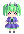

# Documentation

## Folder structure

A mod is a folder containing files. This folder must be placed in the `mods` folder of the mod loader. The location of this folder depends on your operating system:

- Windows: `%APPDATA%\animdustry\mods`
- Linux: `~/.config/animdustry/mods`
- Android: `/storage/emulated/0/Android/data/io.anuke.animdustry/files/mods`

If the folder does not exist, you can create it manually, otherwise it will be created automatically on first startup of the mod loader.

The folder structure of a mod is as follows:

```
modfolder
├── credits.txt
├── mod.json
├── maps
│   └── exampleMap.json
├── music
│   └── exampleMusic.ogg
├── sprites
│   └── exampleSprite.png
├── scripts
│   ├── __api.js
│   ├── exampleScript.js
│   ├── init.js
│   └── main.js
├── units
│   └── exampleUnit.json
├── unitSplashes
│   └── exampleUnit.png
└── unitSprites
    ├── exampleUnit-angery.png
    ├── exampleUnit-happy.png
    ├── exampleUnit-hit.png
    └── exampleUnit.png
```

- **mod.json:** Contains information about the mod.
- **credits.txt:** Additional credits added to the credits of the game. Credits will be auto-generated if this file is missing.
- **maps:** Contains the playable maps this mod adds.
- **music:** Contains the music for the maps. All music files must be OGG files.
- **sprites:** Contains sprites for bullets and enemies.
- **scripts:** Contains scripts that will be executed on startup.
- **units:** Contains unit scripts. The name of a file should match the name of the unit.
- **unitSplashes:** Contains the unit splashes. Unit splashes must be named like the unit they belong to.
- **unitSprites:** Contains in-game sprites for the units.

An example of a mod can be found [here](https://github.com/Pasu4/animdustry-mod-template).

## mod.json

A `mod.json` or `mod.hjson` file must be placed in the root folder of the mod. It is what tells the mod loader that this folder contains a mod. The content of the file is as follows:

```json
{
    "name": "The name of your mod",
    "namespace": "exampleNamespace",
    "author": "You",
    "description": "Description of your mod",
    "enabled": true,
    "debug": false,
    "legacy": false
}
```

- **name:** The name of your mod.
- **namespace:** The namespace of your mod. Must be a valid JavaScript variable name. An object with this name will be automatically created in global JavaScript context.
- **author:** The main author of the mod. Other mentions can be placed in *credits.txt*.
- **description:** The description of your mod. Currently does absolutely nothing.
- **enabled:** Whether the mod should be loaded. Optional, defaults to `true`.
- **debug:** Whether the mod is in debug mode. Debug mode allows to temporarily overwrite state variables for debugging. Optional, defaults to `false`.
- **legacy:** Whether this mod is using the legacy JSON API. Should be `false` if you are making a JavaScript mod. Optional, defaults to `false`.

## Scripts

All JavaScript files inside the `scripts` folder (not recursive) are executed by the mod loader when loading your mod.
If it contains a file named `init.js`, that file is executed first.
If it contains a file named `main.js`, it is executed once all non-main files of all other mods have been executed.
All other files are executed in arbitrary order.
Additionally, if a file is named `__api.js`, it is ignored by the mod loader, this is useful for highlighting in code editors.
You can download the `__api.js` file from the latest release of the mod loader.

Since all mods run in the same context, it is recommended that you use your namespace for function definitions.
Otherwise, variables and functions defined in the global context might be overridden or cause errors.

Since mods are loaded in an arbitrary order, you should not rely upon functions defined by other mods to be available in `init.js`.
Unit and map functions can rely on this, as all mods are loaded by the time they are called.

## Custom Units

Unit scripts describe how a unit is drawn and how it interacts with the game. To define a unit, first place a JSON or Hjson file with the same name as your unit in the `units` folder. Its contents should look like this:

```json
{
    "name": "exampleUnit",
    "title": "-EXAMPLE-",
    "subtitle": "lorem ipsum",
    "abilityDesc": "dolor sit amet",
    "abilityReload": 4,
    "unmoving": false
}
```

- **name:** The internal name of the unit. Used for loading files. Must be a valid JavaScript variable name.
- **title:** The title of the unit displayed at the top of the screen when it is rolled or clicked in the menu.
- **subtitle:** The subtitle, displayed below the title in smaller letters. Usually used for a short description of the unit.
- **abilityDesc:** A description of the unit's ability, displayed in the bottom right corner. May also be used for other descriptions.
- **abilityReload:** How many turns it takes for the unit's ability to activate.
- **unmoving:** If the unit can move. Only used by Boulder in the base game. Optional, defaults to false.

To add a splash image to your unit, place an image file with the same name as your unit into the `unitSplashes` folder. To add in-game sprites of your unit, place the files `example.png` and `example-hit.png` in the `unitSprites` folder (replace "example" with the name of your unit). Those two files must exist for the unit to display properly. Additionally, an `example-angery.png` (not a typo) and `example-happy.png` file can be placed in the folder as well. The `-angery` sprite is displayed when the player misses a beat, and the `-happy` sprite is displayed one second before a level ends.

## Unit scripting

The mod loader expects two functions in your namespace object, a `_draw` and an `_ability` function.
The name of these functions must be in the form `{unit name}_draw` and `{unit name}_ability` respectively.

The `_draw` function draws the unit's splash image.
This is used when you click on a unit in the main menu or roll it with the gacha system.
It takes a single `Vec2` argument, which is the base position of the unit's splash image on the screen.
The [`hoverOffset()`](jsdoc/global.html#hoverOffset) function should be used here to make the unit hover, and the [`getScl()`](jsdoc/global.html#getScl) function should be used to make the unit 'pop out' when it is rolled with the gacha system.

```js
exampleNamespace.exampleUnit_draw = function(basePos) {
    pos = Vec2.add(Vec2.sub(basePos, new Vec2(0, 0.5)), Vec2.scale(hoverOffset(), 0.5));
    drawUnit(Vec2.sub(pos, shadowOffset), getScl(0.165), Color.shadow);
    drawUnit(pos, getScl(0.165));
};
```

The `_ability` function is used to activate the unit's ability during the game.
It is called every time the unit moves to a new tile on the playing field.
The game does *not* check automatically whether the ability has recharged, this is checked using the `moves` variable.
The function takes three arguments: The number of successful moves the player has made, the current position of the player as an integer vector, and the last move direction of the player as an integer vector.

```js
exampleNamespace.exampleUnit_ability = function(moves, gridPosition, lastMove) {
    if(moves % 4 == 0) {
        for(i = 0; i < d8.length; i++) {
            effectExplode(Vec2.add(gridPosition, Vec2.scale(d8[i], 2)));
            damageBlocks(Vec2.add(gridPosition, Vec2.scale(d8[i], 2)));
        }
    }
}
```

## Custom Maps

Map scripts describe a playable level in the game. To add a custom map to the game, place a JSON or Hjson file into the `maps` folder. The contents of the file should look like this:

```json
{
    "name": "exampleMap",
    "songName": "Anuke - Boss 1",
    "music": "boss1",
    "bpm": 100.0,
    "beatOffset": 0.0,
    "maxHits": 10,
    "copperAmount": 8,
    "fadeColor": "fa874c",
    "alwaysUnlocked": true
}
```

- **name:** The internal name of the map. Must be a valid JavaScript variable name.
- **songName:** The name of the song that is displayed in the menu.
- **music:** The name of the music file without the file extension.
- **bpm:** The BPM (beats per minute) of the song.
- **beatOffset:** The music offset in beats. Used if the start of the music is misaligned with the beats.
- **maxHits:** How often the player needs to be hit to fail the map.
- **copperAmount:** The amount of copper the player will receive upon beating the level. How much copper the player actually gets is determined by how well they did in the level and if they have beaten the level before.
- **fadeColor:** (TODO test)
- **alwaysUnlocked:** If true, the map can be played without unlocking all previous maps. Optional, defaults to false.

## Sprites

PNG files in the `sprites` directory of your mod can be used in functions like `makeBullet` to make bullets, enemies, etc. with custom sprites.
To do this, use the path of the file from the `sprites` directory without the file extension.
For example, the file `/sprites/exampleSprite.png` would be used with `"exampleSprite"`.

To use sprites from another mod, you have to use the `importSprite` function.
For ease of use, a mod can provide a method to do this automatically, for example:

```js
exampleNamespace.importSprites() {
    // Import `/sprites/exampleSprite.png` into the calling namespace
    importSprite("exampleSprite", "exampleNamespace");
}
```

**Important:** `importSprite` always imports into the currently active mod's namespace. That means that if you call a function from a different mod that uses sprites, you must import all sprites used in that function into your mod's namespace.


Some sprites are included with the base game. These are:

<details>
<summary>Normal</summary>

 arrow,
 beach,
 big-copper,
 circle,
 ckat,
 cloud1,
 cloud2,
 cloud3,
 cloud4,
 error,
 explode0,
 explode1,
 explode2,
 explode3,
 explode4,
 hit0,
 hit1,
 hit2,
 hit3,
 hit4,
 hit5,
 laser,
 longcloud1,
 longcloud2,
 longcloud3,
 longcloud4,
 longcloud5,
 petal,
 reload,
 shadow,
 smoke0,
 smoke1,
 smoke2,
 smoke3,
 smoke4,
 smoke5,
 star1,
 star2,
 star3,
 sun,
 tile,
 wall,

</details>

<details>
<summary>Outlined</summary>

These sprites are outlined in white.

 arc,
 bullet-blue,
 bullet-pink,
 bullet-purple,
 bullet-tri,
 bullet,
 conveyor,
 copper,
 duo,
 fail,
 headphones,
 health,
 info,
 junction,
 lancer,
 lancer2,
 mine,
 overflow-gate,
 pause,
 play,
 progress-tick,
 progress,
 router,
 settings,
 shield,
 skat,
 sorter,
 unit-alpha-happy,
 unit-alpha-hit,
 unit-alpha,
 unit-boulder-hit,
 unit-boulder,
 unit-crawler-angery,
 unit-crawler-hit,
 unit-crawler,
 unit-mono-happy,
 unit-mono-hit,
 unit-mono,
 unit-oct-angery,
 unit-oct-hit,
 unit-oct,
 unit-oxynoe-hit,
 unit-oxynoe,
 unit-quad-hit,
 unit-quad,
 unit-sei-hit,
 unit-sei,
 unit-zenith-angery,
 unit-zenith-hit,
 unit-zenith,
 warn,
 wave0,
 wave1,
 wave2,
 wave3

</details>

## Map scripting

For each map, three functions must be defined in the mod's namespace, the `_drawPixel` function, the `_draw` function and the `_update` function. Like the unit functions, these must be in the format `{map name}_drawPixel`, `{map name}_draw` and `{map name}_update`.

The `_drawPixel` function is used to draw a map's background.

```js
exampleNamespace.exampleMap_drawPixel = function() {
    drawStripes(Color.parse("#19191c"), Color.parse("#ab8711"));
    drawBeatSquare(Color.parse("#f25555"));
}
```

The `_draw` function is used to draw the playing field.

```js
exampleNamespace.exampleMap_draw = function() {
    drawTiles();
}
```

The `_update` function is used for spawning enemies / obstacles on the playing field.
Since it is called every frame, `state.newTurn` should be used to check for the start of a beat.

```js
exampleNamespace.exampleMap_update = function() {
    if(state.newTurn && state.turn >= 7 && state.turn < 23 && state.turn % 4 == 3) {
        for(i = 0; i < d4edge.length; i++) {
            makeDelayBulletWarn(Vec2.add(playerPos, Vec2.scale(d4edge[i], 2)), Vec2.neg(d4edge[i]));
        }
    }
}
```

## credits.txt

A `credits.txt` file should be placed at the root of your mod folder.
It can be used to give credit for music, art and other mentions.
The contents of this file will be added to the in-game credits.
If no `credits.txt` file is found, the following will be added instead (`name` and `author` are replaced with the respective entries in `mod.json`):

```
- {name} -

Made by: {author}

(Auto-generated credits)
```

## Limitation

The mod loader's JavaScript engine is based on [Duktape](https://duktape.org/).
This comes with a few limitations:

- Users cannot define classes. Instead, Duktape treats all functions as classes (which means all functions can, in theory, be called with `new`).
- User-defined functions cannot have default/optional arguments.
- The `let` keyword is not supported in Duktape.
- `for...of` loops are not supported in Duktape. Either use a `for...in` or `for` loop.
